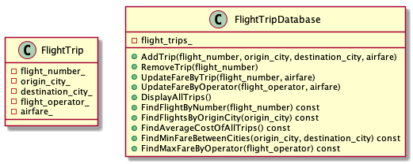
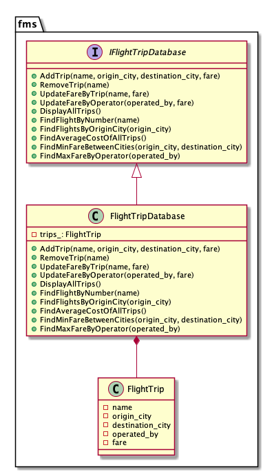

# Flight Management System

## Problem Statement

Design a solution for Flight Management, as given in below code template:

### Assumptions

1. Let's not consider date & time of flight journey to make the problem simpler for now
2. Let's assume flight number is unique in entire database

## Solution

## Prerequisites 

This project uses `bazel` build system hence, it is required to install latest version of `bazel` from official install guide available [here](https://docs.bazel.build/versions/master/install.html).

`Bazel` takes care of external dependencies and packages used in this project.

This project requires `C++14` supported compiler (i.e. `GCC`)

## Build

To build, run `bazel build //...`

To build in Debug mode, run `bazel build --config=dbg //...`.

## Run Tests

To run unit tests, run `bazel test //... --test_output=all`

To run executable application, run `bazel run //:app_main`

## Docker
 
This project also provides and supports Docker Container, mainly used for CI/CD. 

1. Pull Docker Container Image, `docker pull registry.gitlab.com/jinay1991/flight_management`
2. Run Docker Container, `docker run -it -v /path/to/this/repo:/workspace registry.gitlab.com/jinay1991/flight_management`

## Results

1. [Code Coverage Report](https://jinay1991.gitlab.io/flight_management/coverage/index.html)
2. [Static Code Analysis Report](https://jinay1991.gitlab.io/flight_management/static_code_analysis_report/)
3. [Documentation](https://jinay1991.gitlab.io/flight_management/doc/html/index.html)
4. [Issue Board](https://gitlab.com/jinay1991/flight_management/issues)

